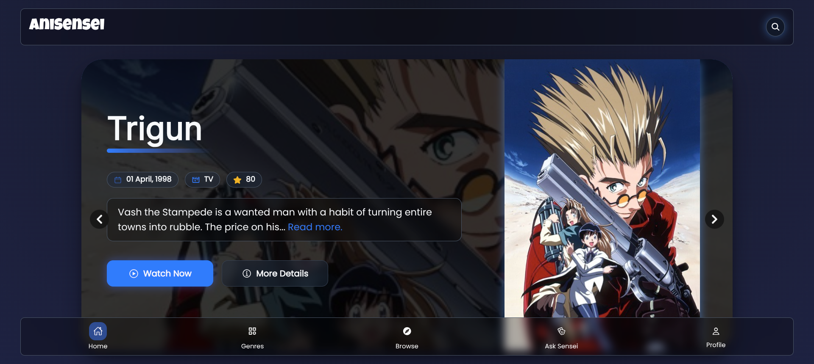
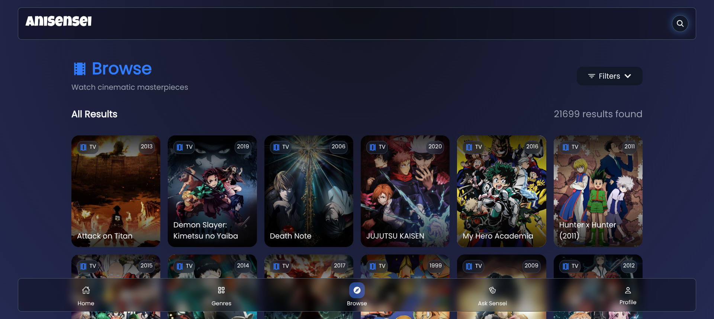
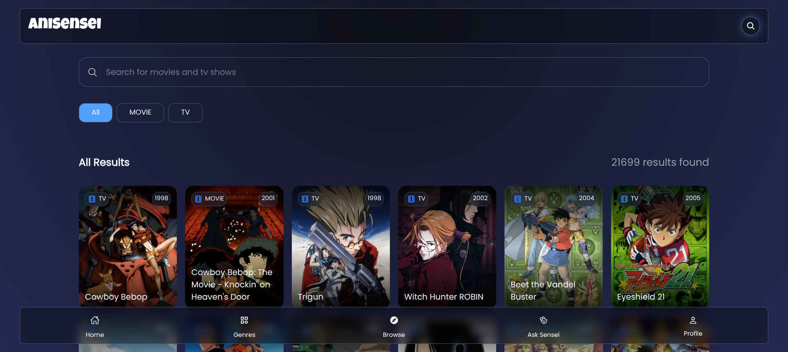
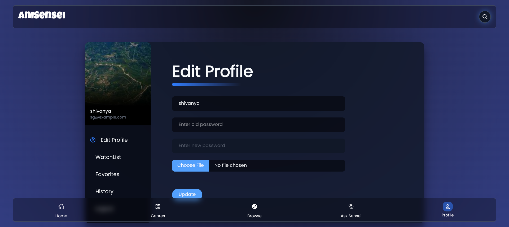

<p align="center">
  <a href="https://AniSensei-z.vercel.app/" target="_blank">
    
  </a>
</p>

<p align="center" style="font-size: 28px; font-weight: 700; margin: 0;">
  AniSensei – Your Ultimate Anime Companion
</p>

<p align="center">

  <!-- ⭐ Stars -->
  <a href="https://github.com/shiv-anya/AniSensei/stargazers">
    
  </a>

  <a href="https://github.com/shiv-anya/AniSensei/issues">
    
  </a>

  <!-- 🍴 Forks -->
  <a href="https://github.com/shiv-anya/AniSensei/forks">
    
  </a>

</p>

<div align="center">

AniSensei is a modern anime streaming and recommendation platform built with **Next.js**, **TypeScript**, and **Tailwind CSS**.  
It helps you explore, track, and enjoy anime like never before — featuring smart recommendations, detailed browsing filters, and a clean, immersive interface.

</div>


---
<details>
  <summary><strong>✨ View Features</strong></summary>

<br />

### 🚀 Core Features

- 🔍 **Advanced Search** — Search anime by name, format, or genre  
- 🧠 **AI Recommendations** — Get personalized anime suggestions based on your mood  
- ⭐ **Favorites** — Save your favorite anime for quick access  
- 🕒 **Watch History** — Automatically tracks what you've watched  
- 📌 **Watchlist** — Keep track of shows you plan to watch  
- 💬 **AI Chat** — Ask recommendations, summaries, or details anytime  
- 🔐 **Authentication** — Secure login & signup using JWT + cookies  
- 🎞️ **Beautiful UI** — Clean, responsive, modern design built with Tailwind CSS  
- ⚡ **Optimized Performance** — Fast load times, client/server rendering where needed

<br/>

</details>

## Previews
<details>
  <summary><strong>See attachments</strong></summary>

### Additional Screenshots
- 
- 
- 
- 

</details>

## Installation and Local Development

1. **Clone the repository**
   
   ```bash
   git clone https://github.com/shiv-anya/AniSensei.git
   
2. **Move into the project directory**

    ```bash
   cd AniSensei
    
4. **Install dependencies**

   ```bash
   npm install
   
6. **Create a .env.local file**
   
   ```bash
    MONGODB_URI=your_mongodb_connection_string
    JWT_SECRET=your_secret_key
    REACT_APP_GEMINI_API_KEY=your_google_gemini_api_key
   
8. **Run the development server**

   ```bash
   npm run dev
   
10. **Open the project**
    ```bash
    http://localhost:3000

---

## ⭐ Support
If you like this project, please consider giving it a star — it helps the project grow and reach more developers!
